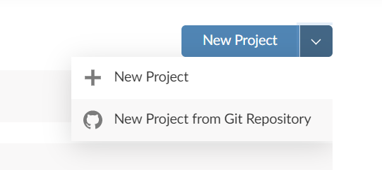

```{css, echo=FALSE}
img {
  display: block; margin-left: auto; margin-right: auto;
}
```

```{r setup, echo=FALSE}
knitr::opts_chunk$set(
  warning = FALSE, tidy.opts = list(width.cutoff = 90), tidy = TRUE,
  fig.align = "center", fig.width = 10
)
```

In [March, 12th](https://tcrn.ch/3aSjWNY), Github has launched the [Github Classroom](https://classroom.github.com/) platform.

TL; DR, click [here](/posts/using-rstudio-with-github-classroom).

**Disclaimer**: Everything I say here is only my opinion, and some better solution may exist that I could not find yet.

Here is the long story:

## Classroom

For those that want to know more about the capabilities of Github Classroom, I recommend you start [here](https://classroom.github.com/help).

As soon as I knew about it, I felt that I should use it.
Don't ask me why.
But, as I mainly use R for working, I quickly realized that RStudio was not one of the 'off the shelf' options for Online IDE. I was even surprised that one of the options is MS MakeCode.

## Using RStudio

So that's why I had to find a way thru this.

First, I tried to find a way to integrate RStudio Cloud with Github Classroom.
No deal.
RStudio Cloud has no API that can trigger a New Project. It requires you to copy the link and fill the form:

{width="50%"}

The current solution uses [mybinder.org](https://mybinder.org/) as the cloud service that will create our RStudio session.
If someone finds out how to use RStudio Cloud automatically, please, send me a message.
I'm looking forward to using that.

Before coming out with the current solution, I just put a binder badge on assignment README and realize that mybinder also needs a hand to figure out the repository we want to use.

Then I started to look at how to change the README programmatically when the student forks the assignment.
The first thing that came into my mind was GitHub's actions.
The first attempt failed.
My bad.

Then I found that [CloudFlare](https://www.cloudflare.com/) had something I could use: Workers.

Essentially, I get a static link, and the user is redirected to the custom link in mybinder.org.
I had to take leverage on the referer header to work out.
Here was the code:

``` {.javascript}
const base = "https://mybinder.org/v2/gh"
const postfix = "/master?urlpath=rstudio"
const statusCode = 302

async function handleRequest(request) {
  
  const url = new URL(request.headers.get('referer'))
  
  const { pathname, search, hash } = url

  const destinationURL = base + pathname + postfix

  return Response.redirect(destinationURL, statusCode)
}

addEventListener("fetch", async event => {
  event.respondWith(handleRequest(event.request))
})
```

It worked fine.
Did the job.
But I had another problem: speed.

Every time the student clicks on the mybinder badge, mybinder started to build the environment from scratch.
One of the suggestions from [mybinder howto](https://mybinder.readthedocs.io/en/latest/howto/speed.html) is "Ensure your repository gets a lot of clicks".
Sure.
That works because after the environment is built, the next launch is fast.
But the students need to push changes in the code to check if the answer is right (considering Github's auto-grading).

Digging here, digging there, I found a nice Github Action called [`repo2docker`](https://github.com/marketplace/actions/repo2docker-action) that deserves to be mentioned.
It does the following: pre-build the docker in Github's realm and caches it on mybinder that finishes the build.
This action is triggered as soon as the student forks the assessment or pushes any change.
This action is still being used in my current solution, but not in the assignment itself.

Another suggestion from [mybinder howto](https://mybinder.readthedocs.io/en/latest/howto/speed.html) was "Use two repositories: one for the environment, one for your content".
That I missed entirely on the first time, but not in the second.
Clever!
So I moved all the mybinder code from the assessment itself and built a template just for the RStudio environment.
Once I push (rarely) some change to that repository, it triggers the build, and it's done.

But now I had another problem.
This new setup leverages on [nbgitpuller](nbgitpuller.link?tab=binder) that pulls the assessment repository into the mybinder session just before the session launch.
First thing, the assessment repository must be public since I could not find a way to give credentials to nbgitpuller (anybody?).
Second, the link that was generated by the nbgitpuller website is adorable.
So I had to (again) try the CloudFlare hack to make it work.

Finally, I went again to the Github Actions topic to learn more about it, and I found that what I was doing with CloudFlare could be done with Github Actions.

My first attempt was using the [Action Dynamic Readme](https://github.com/varunsridharan/action-dynamic-readme), which did the job pretty well.
But I realized I would like to have some in-house code to deal with this matter.
Don't get me wrong, but my problem was that the current action was too big for what I needed.
It depends on another action to expose several variables, and the main code was done using the Docker approach and, to my surprise, PHP.
This fellow actually did a great job creating an action-toolkit for PHP.
Well, there was too much code for me to keep track of security issues, then I did it.
Yes, I did code my own action.
[Here is the link](https://github.com/marketplace/actions/replace_envs).
It's JavaScript, simple, basic, unsophisticated, ordinary, but does the job, fast.

And now we can start with the tutorial:

### Step 1 - Create your environment

First, you need to create a repository that will contain the RStudio session settings.
That is the best way to do it because if you do not separate the assignment code from the IDE code, every student will have to **build** its own docker every time they push something new to their assignment.
**This takes time!**

Here I published a template repository where you can derive your configurations:

[RStudio MyBinder Environment](https://github.com/franzbischoff/rstudio_mybinder_env)

**Changes you need to make**

-   In file `.rstudio/projects/settings/last-project-path`, you need to change the values there to your own. Leave the `/home/jovyan/` there.

**Changes you may want to make**

-   In file `.binder/install.R`, you specify the packages that will be installed by default in the environment.

### Step 2 - Create the assignment repository

There are some requirements to make this work:

-   The repository must have a .RProj file (e.g., Assignment.Rproj).
    And this name must be the same you set in Step 1 (in last-project-path).
    For now, this is a requirement.

-   You must have a `README.md` with the following link (adapted from the generated URL from [nbgitpuller link generator](https://jupyterhub.github.io/nbgitpuller/link?tab=binder)):

``` {.html}
<a href="https://mybinder.org/v2/gh/YOUR_USERNAME/YOUR_FORK/main?urlpath=git-pull%3Frepo%3Dhttps%253A%252F%252Fgithub.com%252F${REPOSITORY_ACCOUNT}%252F${REPOSITORY_SLUG}%26targetPath%3DYOUR_CLASSROOM%26urlpath%3Drstudio%252F%26branch%3Dmain">
  
</a>
```

-   **Pay attention** to the strings you must set: `YOUR_USERNAME`, `YOUR_FORK`, `YOUR_CLASSROOM`.

    Also **pay attention** that recently, Github is changing the default repository from `master` to `main`.

    The variables `${REPOSITORY_SLUG}` are variables that will be automatically replaced by a Github action.
    Explained in the [long story post](using-rstudio-with-github-classroom-long).

    If you generate the `README.md` from an Rmd file, it is really recommended that you use the plain HTML above since `knitr` or something else seems to recode the URL, and I could not find a way to disable that.

-   Create a workflow at `.github/workflows/configure_readme.yml` with the following Github action: [**replace_envs**](https://github.com/marketplace/actions/replace_envs).
    And, to avoid this action runs in your template, but in student's fork, add this line before `steps`:

``` {.yaml}
if: contains(github.event.head_commit.message, 'Classroom')
```

### Step 3 - The autograding

Github Classroom has an option to create an automatic grading, so the students can push answers for solving the assessment, and the system will automatically verify if it is right.

That is not fancy stuff;**you** have to define what is right or wrong and how much.

I've tried to leave my files in the template repository, but Github Classroom will currently overwrite them when the student accepts the task.

So, how I'm doing currently:

-   Create a `test.R` file, and use your skills to assess the student's answer.
    My lazy approach makes the student save a file called `output.rda` containing the variable `answer`, and my script loads the `output.rda` file and compares the SHA1 of the `answer` with the right answer.
    Use `quit(status = 0)` and `quit(status = 1)` to tell the system that the answer is ok or not.

-   Create a `test.sh` file that calls the `test.R` file.
    This script can handle several R scripts separately if you want to test for several answers and make partial grading, for example.
    Just use a bash script like:

``` {.bash}
echo "Running tests..."

if Rscript --vanilla .assets/scripts/test.R ; then
 echo "Pass: Program exited zero"
else
 echo "Fail: Program did not exit zero"
 exit 1
fi

echo "All tests passed."

exit 0
```

-   Finally, when you create the auto-grading in your assignment, choose the options:

    -   Repository: `Public`.
        That is a limitation (for now) since `nbgitpuller` doesn't have access to private repositories.
        That may be a problem for countries that require that student assignments must be private.

    -   Online IDE: `Don't use an online IDE`.

    -   Add test: `Run Command`.

        In this option, set as `setup`:

        `sudo apt-get update; sudo apt-get remove -y r-base r-base-core; sudo apt-get install -y r-base r-base-core r-cran-digest` (this removes and installs again the `R` in the test environment, because if you use the one it is there, some important packages as `r-cran-ggplot2` will fail to install. Additionally, I install the `r-cran-digest` package that has the SHA1 algorithm.)

        and as `run`:

        `bash .assets/scripts/test.sh`

I hope this post can save some academic lives, or at least save some time, and maybe get some Github's or RStudio's attention to this matter.

Any comment is welcome.
