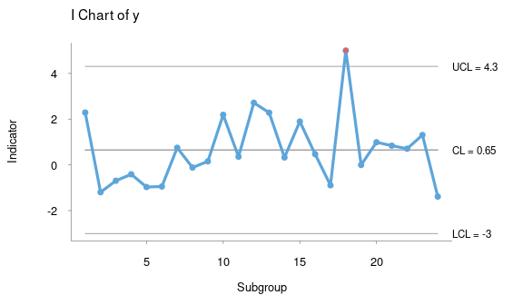

```{r setup, include=FALSE}
knitr::opts_chunk$set(echo = FALSE,
                      fig.show = "hold",
                      fig.align = "center",
                       dpi = 100)
knitr::opts_knit$set(progress = TRUE)
library(MASS)
```

# What is a Time Series {#what-is-a-time-series}

-   A set of observed values ordered in time, or we can say, repeated measurement of something usually with the same fixed interval of time (hourly, weekly, monthly).

-   A collection of observations made sequentially in time[@chatfield1996].

-   If the variable we are measuring is a count variable, we may have a [Poisson Time Series](https://rpubs.com/franzbischoff/poisson_regression){target="_blank"} (that is for later).

-   A time series $T \in \mathbb{R}^n$ is a sequence of real-valued numbers $t_i \in \mathbb{R} : T=[t_1,t_2,\dots,t_n]$ where $n$ is the length of $T$.

Most of the classic statistical theory is based on the assumption of sample randomness and independent observations.
On the other hand, time series is just the opposite.
Observations are usually dependent on previous values, and their analysis must take into account their temporal order.

For example, a prospective cohort study comparing "injury rate before and after" an implemented program, analyses of time trends, such as Poisson regression and time series analysis, considers the variability that occurs over the study period apart from the change associated with the intervention.
They also avoid the loss of information about variability in incidence over time when rates are aggregated into one before and one after rate.
The population is its own control.

If previous observations can predict future observations exactly, we have a deterministic process.
However, the exact prediction is usually impossible since past values determine only part of the future value.
In this case, we say the process is stochastic, and the future values must be seen as a probability conditioned on the past values.

There are many models available to describe the behavior of a particular series.
The choice of such a model depends on factors such as the behavior of the phenomenon or the prior knowledge of its nature and the purpose of the analysis.

## Types of Time Series

1.  Measured at regular time intervals (discrete), examples:

    -   Economic: stock market;

    ```{r type_economic}
    plot(EuStockMarkets[, 1], main = "Daily closing prices of DAX", ylab = "Price")
    ```

    -   Physical/Biological: Pluviometry, DNA;

    ```{r type_physical}
    plot(((nhtemp) - 32) * 5 / 9, main = "*Average* Yearly Temperatures in New Haven", ylab = "Temperature in  ºC")
    ```

    -   Marketing: sales per month;

    ```{r type_marketing}
    plot(BJsales, main = "Daily Sales Data (150 days)", ylab = "Sales")
    ```

    -   Demographics: population per year, car accidents per day;

    ```{r type_demographics}
    plot(austres, main = "Quarterly Time Series of the Number of Australian Residents", ylab = "Residents")
    ```

    -   Process control: factory measurements like final can weights, quality scores;

    ```{r type_process_control}
    
    ```

    ::: {style="font-size:70%;text-align:center"}
    image from package `qicharts`
    :::

2.  Measured at irregular time intervals (events), examples:

    -   Point processes: earthquakes (events)

    ```{r type_earthquakes, message=FALSE, warning=FALSE}
    eq_data <- readr::read_csv("https://earthquake.usgs.gov/earthquakes/feed/v1.0/summary/2.5_day.csv")
    eq_data$yes <- 0
    plot(eq_data$time, eq_data$yes, main = "USGS Magnitude 2.5+ Earthquakes, Past Day",
         ylab = "Event", xlab = "Time of the day", yaxt = 'n', sub = paste("Data from ", Sys.Date()))
    ```

    ::: {style="font-size:70%;text-align:center"}
    Data downloaded from <a href="https://earthquake.usgs.gov/earthquakes/feed/v1.0/summary/2.5_day.csv">usgs.gov</a>
    :::

3.  Measured continuously, examples:

    -   Binary processes: communication theory (turn-on/turn-off, zeros and ones);

    ```{r type_binary, message=FALSE, warning=FALSE}
    set.seed(2114)
    binary_data <- unlist(replicate(10, rep(runif(1) < 0.5, floor(runif(1, 10, 20)))))
    binary_data <- stepfun(seq_len(length(binary_data) - 1), binary_data)
    plot(binary_data, main = "Syntetic binary example", ylim = c(0,1),
         ylab = "Value", xlab = "Continuous time", do.points = FALSE, yaxp = c(0, 1, 1))
    ```

    -   Analog signals: sound, temperature, humidity, ECG[^1].

    ```{r type_ecg, message=FALSE, warning=FALSE}
    ecg_example <- readr::read_csv("ecg_example.csv")
    plot.ts(ecg_example, main = "ECG example", ylim = c(-4, 7), yaxp = c(-2, 4, 3),
         ylab = "Value", xlab = "Continuous time (ms)", xlim = c(0, 1000))
    ```

    ::: {style="font-size:70%;text-align:center"}
    Data from <a href="https://www.physionet.org/content/challenge-2015/1.0.0/">Physionet</a>, record `a103l`
    :::

# The goals of Time Series Analysis

## Description

Like any kind of data analysis, the first step is to know the data.
It is imperative to plot a time series before trying to analyze it.
This simple step will show us any noticeable trend or seasonal variation and allow us to spot outliers[^2] or some turning point in the data, which may require the use of more than one mode to fit each part of the data.

## Explanation

When we have multiple variables collected simultaneously, it may be possible to find some correlation between them.
The variation of one time series may explain the variation in another time series.
Multiple regression models may be helpful here.
We can also convert an input series into an output series by a linear operation and try to understand the relationship between both series.

## Prediction

Using the previously available data, we may want to predict the future values of that series.
Historically, the terms "prediction" and "forecasting" may be used interchangeably or not.
Thus it is essential to pay attention to how the literature is referring to both terms.
Sometimes "prediction" may refer to subjective methods or the procedure to achieve the "forecasting" (the objective method or the actual future values).
There is a close relationship between prediction and control problems where manufacturing processes that are going to move off-target can be proactively corrected.

## Control

When the time series is originated from measures of "quality" of a manufacturing process, the objective of the analysis is to **control** this process.
There are specific methods to do such control, and this topic is outside the scope of this article.
Further information is available on specific literature called Statistical Quality Control[@montgomery2012].

# Before Modeling Time Series

## Transformations

-   Stabilize variance: a logarithmic transformation may reduce the variance;

```{r deal_variance}
claims <- ts(Insurance$Claims, start = c(1973, 365.25*3/4), frequency = 365.25)
oldpar <- par(mfrow = c(2, 1), mar = c(3.1, 4.1, 2.1, 1.1))
plot.ts(claims, main = "Numbers of Car Insurance claims (1973, Q3)", ylab = "Claims")
par(mar = c(5.1, 4.1, 0.1, 1.1))
plot(log(claims), ylab = "log(Claims)")
par(oldpar)
```

-   Make seasonality additive: a logarithmic transformation transforms a multiplicative seasonality into an additive one. However, this will only stabilize the variance if the error term is also multiplicative.

```{r deal_additive}
oldpar <- par(mfrow = c(2, 1), mar = c(3.1, 4.1, 2.1, 1.1))
plot(AirPassengers, main = "Monthly totals of international airline passengers", ylab = "Passengers")
par(mar = c(5.1, 4.1, 0.1, 1.1))
plot(log(AirPassengers), ylab = "log(Passengers)")
par(oldpar)
```

-   Normalize data distribution: data is usually assumed to be normal. Logarithmic and square-root are used; however, they are just special cases of the Box-Cox transformation. The parameters may be estimated by inference, and in general, the transformation cannot overcome all requirements at the same time.

```{r deal_normality}
ozone <- ts(na.omit(airquality$Ozone))
layout(mat = matrix(c(1, 1, 2, 3), ncol = 2, byrow = TRUE))
plot.ts(airquality$Ozone, main = "New York Air Quality Measurements, May to September 1973", ylab = "Ozone", xlab = "Time")
hist(ozone, probability = 1); lines(density(ozone), col = "red")
hist(log(ozone), probability = 1); lines(density(log(ozone)), col = "red")
```

It is interesting to note that Nelson and Granger, in 1979, found little benefit in applying a general Box-Cox transformation in several datasets.
Usually, it is advised to apply the least possible transformations, except when the variable has a direct physical interpretation.

## Dealing with Trends

Trends in time series are difficult to define and have more than one "formal" definition in literature.
Loosely we can say that trend is a "long-term change in the mean level." The main problem is how to define "long-term" in every situation.

The practical importance of a time series with a trend depends on whether we want to **measure the trend** and/or **remove the trend** so we can analyze the higher frequency oscillations that remain.

It is important to remember that sometimes we may be more interested in the trend than what is left after removing it.

### Curve Fitting

This technique is not more than removing the trend and analyze the "residuals".
In general, particularly for yearly data, we can use a simple polynomial curve.

```{r trends_curve_fitting}
oldpar <- par(mfrow = c(2, 1), mar = c(3.1, 4.1, 2.1, 1.1))
plot(AirPassengers, main = "Monthly totals of international airline passengers", ylab = "Passengers")
fit <- lm((AirPassengers) ~ seq_along(AirPassengers))
pred <- predict(fit, data.frame(seq_along(AirPassengers)))
pred <- ts(pred, start = start(AirPassengers), frequency = frequency(AirPassengers))
data <- AirPassengers / pred
lines(pred, col = "red")
par(mar = c(5.1, 4.1, 0.1, 1.1))
plot(data, ylab = "Passengers / fitted")
par(oldpar)
```

### Filtering

Filtering is a little more complex operation than curve fitting.
We are not just trying to find a polynomial that best fits our data, but we are transforming our original TS into another TS using a formula (that here we call filter).
This filter can be one of several kinds of "Moving Averages," locally weighted regressions (e.g., LOESS), or "Splines" (a piecewise polynomial).
One caveat of these smoothing techniques is the end-effect problem (since in one end of the time series, we do not have all the values to compute, for example, the moving average).

Simple moving average ex: $Sm(x_t) = \frac{1}{2q+1} \sum^{+q}_{r = -q}x_{t+r}$

Example with splines:

```{r trends_curve_fitting2}
oldpar <- par(mfrow = c(3, 1), mar = c(3.1, 4.1, 2.1, 1.1))
plot(USAccDeaths, main = "Accidental Deaths in the US 1973–1978", ylab = "Accidental Deaths")
pred <- smooth.spline(USAccDeaths, nknots = 15)$y
pred <- ts(pred, start = start(USAccDeaths), frequency = frequency(USAccDeaths))
lines(pred, col = "red")
par(mar = c(5.1, 4.1, 0.1, 1.1))
data <- USAccDeaths - pred
plot(data, ylab = "Deaths - spline")
par(mar = c(5.1, 4.1, 0.1, 1.1))
data <- USAccDeaths / pred
plot(data, ylab = "Deaths / spline")
par(oldpar)
```

### Differencing {#differencing}

It is a special kind of filtering, where we compute the difference between the current value and the next.
It is helpful to remove trends, making a TS stationary.
We can use differencing multiple times (we call "orders"), but usually, one ("first-order") iteration is sufficient.
The mathematical operator used to denote differencing is the "nabla" ($\nabla$).
$\nabla^2$ means second-order differencing.

```{r trends_diff}
oldpar <- par(mfrow = c(2, 1), mar = c(3.1, 4.1, 2.1, 1.1))
plot(co2, main = "Mauna Loa Atmospheric CO2 Concentration", ylab = "CO2 concentration")
par(mar = c(5.1, 4.1, 0.1, 1.1))
plot(diff(co2), ylab = "diff(co2)")
par(oldpar)
```

See that the example above removed the trend, but kept the seasonality.

> **The Slutzky-Yule effect**[@loynes2005]: They showed that by using operations like differencing and moving average, one could **induce** sinusoidal variation in the data that, in fact, is not real information.

## Dealing with Seasons

As for trends, the analysis of seasonal variation depends on whether we want to **measure the seasonal effect** and/or **remove the seasonality**.

For a time series with a slight trend, a straightforward estimate of the seasonal effect is to take the average of every January (for example) and subtract (in additive case) or divide by (in multiplicative case) the average of the year.

For a time series with a significant trend, a more robust approach may be taken.
For monthly data, we can use:

$$
Sm(x_t) = \frac{\frac{1}{2}x_{t-6} + x_{t-5} + x_{t-4} + \cdots + x_{t+5} + \frac{1}{2}x_{t+6}}{12}
$$

The seasonality can also be eliminated by differencing with lag.
For example, with monthly data, we can use the operator $\nabla_{12}$:

```{r seasons_diff}
oldpar <- par(mfrow = c(2, 1), mar = c(3.1, 4.1, 2.1, 1.1))
plot(USAccDeaths, main = "Accidental Deaths in the US 1973–1978", ylab = "Accidental Deaths")
par(mar = c(5.1, 4.1, 0.1, 1.1))
plot(diff(USAccDeaths, lag = 12), ylab = "diff(lag = 12)")
par(oldpar)
```

$$
\nabla_{12}x_t=x_t-x_{t-12}
$$

See that the example above removed the seasonality, but kept the trend.

## Autocorrelation

It may be the fundamental property of a time series.
As pointed before in [section 1](#what-is-a-time-series), time series data has the assumption of non-independence, and autocorrelation is just how we turn this property into an objective and measurable value.
Autocorrelation measures the correlation between observations at different time lags.
As we may observe, at time zero, the coefficient is one because the observed value totally agrees with itself, and sometimes this coefficient is skipped in some plots.
The distribution of these coefficients provides us insight into the probability model that had generated this series.
Later in [section 4.1](#stationary-processes), we will write the definition of this property.

### The correlogram {#the-correlogram}

The graphic representation of the autocorrelation coefficients is called a correlogram, in which the coefficient $r$ is plotted against the lag $k$.

Interpretation.
Here we offer some general advice:

-   **Random series:** for a large $N$, $r_k \simeq 0$ for all non-zero values of $k$.
    Usually, 19 out of 20 of the values of $r_k$ lie between $\pm 2/\sqrt{N}$.

-   **Short-term correlation:** Stationary series usually presents with a short-term correlation.
    What we see is a large value for $r_1$, followed by a geometric decay.

-   **Alternating series:** If the data tends to alternate sequentially around the overall mean, the correlogram will also show this behavior: the value of $r_1$ will be negative, $r_2$ will be positive, and so on.

-   **Non-stationary series:** If the data has a trend, the values of $r_k$ will not come to zero, only for large lag values.
    This kind of correlogram has little to offer since the trend muffles any other features we may be interested in.
    Here we can conclude that the correlogram is only helpful after removing any trend (in other words, turn the series stationary).

-   **Seasonal fluctuations:** If the data contains seasonal fluctuations, the correlogram will display an oscillation of the same frequency.

### Testing for randomness

There are valuable tools to test if the data is random or not.
For the sake of simplicity, this subject will not be covered in this article.
However, testing residuals for randomness is a different problem[@chatfield1996] and will be discussed later.

# Stochastic Processes {#stochastic-processes}

In the real world, most processes have in their structure a random component.
The term "stochastic" is a Greek word that means "pertaining to chance." A more formal definition of a stochastic process is: "a collection of random variables which are ordered in time and defined at a set of time points which may be continuous or discrete"[@chatfield1996].

Most statistical problems are focused on estimating the properties of a population from a sample.
In time series, we need to realize that each data point is a "sample" of the "population" at that given time.
When we read a value from a sensor (for a plausible example, let us think of an arterial line that measures the blood pressure directly), we read a unique value at that time, not the distribution of values that could be possible read.
This infinite set of possible values that could compose our time series is called an **ensemble.** The actual time series we have is one of the possibly **realizations** of the stochastic process.

As with other mathematical functions, a simple way to describe the stochastic process (as probability function) is using its [moments](https://en.wikipedia.org/wiki/Moment_(mathematics)).
The first moment is the mean, and the second moment is the variance (and the autocovariance, for a sequence of random variables).

## Stationary Processes {#stationary-processes}

It is the process that is ready to model.
In other words, the previous steps before modeling a time series are to make it stationary.
Loosely speaking, a stationary process is a process that has a constant mean, variance, and no periodic variations.

Formally, a we can say a process is strictly stationary if the joint distribution of $X(t_1), \dots, X(t_n)$ is the same as the joint distribution of $X(t_1 + \tau), \dots, X(t_n+ \tau) \;\; \text{for all} \;\; t_1,\dots,t_n,\tau$.
Strict stationarity implies that

$$
\mu(t)=\mu \\
\sigma^2(t) = \sigma^2
$$

are constants independently of the value of $t$.
In addition, the joint distribution of $X(t_1)$ and $X(t_2)$ depends only on $(t_2-t_1)$, which is called the **lag**.
Thus the autocovariance function (ACVF) $\gamma(t_1, t_2)$ also depends only on $(t_2-t_1)$ and may be written as $\gamma(\tau)$ (the autocovariance coefficient at lag $\tau$).

As the autocovariance coefficient depends on the units in which $X(t)$ is measured, the **ACVF** is standardized to what is called the **autocorrelation** function (**ACF**), which is given by

$$
\rho(\tau)=\gamma(\tau)/\gamma(0)
$$

which measures the correlation between $X(t)$ and $X(t+\tau)$.

The reasoning behind the suggestion that the distribution of $X(t)$ should be the same for all $t$ resides in the fact that many processes that converge to an **equilibrium** as $t \rightarrow \infty$, which the probability distribution of $X(t)$ does **not** depend on the initial conditions.
With this assumption, after the process has been running for some time, the probability distribution of $X(t)$ will change very little.

Strict stationarity is very restrictive and few processes achieve it.

### Second-order Stationarity

A more helpful definition, for practical reasons, is a less restricted definition of stationarity where the mean is constant, and **ACVF** only depends on the lag.
This process is called second-order stationary.

This simplified definition of stationarity will be generally as long as the properties of the processes depend only on its structure as specified by its [first and second moments](#stochastic-processes).

## The autocorrelation function

As shown in [section 3.4.1](#the-correlogram), the autocorrelation coefficients are helpful in describing a time series.
The autocorrelation function (**ACF**) is an essential tool for assessing its properties.

Here we will describe the properties of the **ACF**.

Suppose a stationary stochastic process $X(t)$ has mean $\mu$, variance $\sigma^2$, **ACVF** $\gamma(\tau)$, and **ACF** $\rho(\tau)$.
Then

$$
\rho(\tau)=\gamma(\tau)/\gamma(0) = \gamma(\tau)/\sigma^2 \qquad \text{for } \rho(0)=1
$$

### Property 1

The **ACF** is an **even** function of the lag in that

$$
\rho(\tau)=\rho(-\tau)
$$

This property just states that the correlation between $X(t)$ and $X(t + \tau)$ is the same as that between $X(t)$ and $X(t-\tau)$.
The result is easily proved using $\gamma(\tau)=\rho(\tau)\sigma^2$ by

$$
\begin{aligned}
\gamma(\tau)&=Cov[X(t), X(t+\tau)] \\
            &=Cov[X(t-\tau), X(t)] \qquad \text{since} \; X(t) \; \text{stationary} \\
            &=\gamma(-\tau)
\end{aligned}
$$

### Property 2

$|\rho(\tau)| \leq 1$.
This is the "usual" property of a correlation.
It is proved by noting that

$$
Var[\lambda_1 X(t) + \lambda_2 X(t+\tau)] \geq 0
$$

for any constants $\lambda_1, \lambda_2$ since variance is always non-negative.
This variance is equal to

$$
\lambda_1^2 Var[X(t)] + \lambda_2^2 Var[X(t + \tau)] + 2 \lambda_1 \lambda_2 Cov[X(t), X(t + \tau)] = (\lambda_1^2 + \lambda_2^2) \sigma^2 + 2 \lambda_1 \lambda_2 \gamma(\tau)
$$

When $\lambda_1 = \lambda_2 = 1$, we find

$$
\gamma(\tau) \ge -\sigma^2
$$

so that $\rho(\tau) \ge -1$.
When $\lambda_1 = 1, \lambda_2 = -1$, we find

$$
\sigma^2 \ge \gamma(\tau)
$$

so that $\rho(\tau) \le +1$

### Property 3 {#property-3}

Lack of uniqueness.
A stochastic process has a unique covariance structure.
However, the opposite is not valid.
We can find other processes that produce the same **ACF**, adding another level of difficulty to the sample **ACF** interpretation.
To overcome this problem, we have the invertibility condition that will be described later on [Moving average processes](#moving-average-processes).

## Some useful stochastic processes

### Purely random process

A process can be called purely random if it is composed of a sequence of random variables $\{Z_t\}$ that are independent and identically distributed.
By definition, it has constant mean and variance, given that

$$
\gamma(k)=Cov(Z_t, Z_{t+k}) = 0 \qquad \text{for}\;k=\pm 1, 2, \dots
$$

Since the mean and **ACVF** do not depend on time, the process is second-order stationary.
In fact, it also satisfies the condition for a strictly stationary process.
The **ACF** is given by

$$
\rho(k)=\left\{
\begin{array}{ll}
1 & k=0 \\
0 & k=\pm 1, \pm 2, \ldots
\end{array}\right.
$$

```{r acf_random}
set.seed(2021)
normal_random <- rnorm(500)
oldpar <- par(mfrow = c(2, 1), mar = c(3.1, 4.1, 2.1, 1.1))
plot.ts(normal_random, main = "Purely random series - N(0, 1)", ylab = "Value")
par(mar = c(5.1, 4.1, 0.1, 1.1))
acf(normal_random, lag.max = 1000)
par(oldpar)
```

::: {style="font-size:70%;text-align:center"}
In the example above, the **ACF** function was kept along the entire dataset for academic purposes.
Normally it is shown only the $10*log10(N/m)$ lags, where $N$ is the number of observations and $m$ the number of series (from `acf {stats}` manual).
:::

This type of process is of particular importance as building blocks of more complicated processes such as moving average processes.

### Random walk

The Random Walk is a process very similar to the previous process.
The difference lies in that the current observation sums the current random variable to the previous observation instead of being independent.
The definition is given by

$$
X_t=X_{t-1}+Z_t
$$

Usually, the process starts at zero for $t=0$, so that

$$
X_1=Z_1
$$

and

$$
X_t= \sum_{i=1}^t Z_i
$$

Then we find that $E(X_t)=t\mu$ and that $Var(X_t)=t\sigma^2_Z$.
As the mean and variance change with $t$, the process is non-stationary.

```{r stoch_rwalk}
set.seed(2021)
random_walk <- cumsum(rnorm(500))
plot.ts(random_walk, main = "Random Walk - N(0, 1)", ylab = "Value")
```

Meanwhile, the interesting feature is that the first difference of a random walk forms a purely random process, which is therefore stationary.

### Moving average processes {#moving-average-processes}

First, not to be confused with the **moving average** algorithm.
The moving average process is a common approach to model a univariate time series.
The concept is that the current value $X_t$ depends **linearly** on $q$ past values of a stochastic process.
Another practical way to see this process is imagining the process as a finite impulse applied to a white noise.
This impulse "has" affected the $q$ previous values and the current.

The moving average process only remembers the $q$ previous components of the random process[^3], so it is also limited to $q$ steps in the future.
After that, one cannot predict any value without new random values being generated[@siegel2016].

Here we will say that $\{Z_t\}$ is a process that only generates purely random values with mean zero and variance $\sigma^2_Z$.
Then the process $\{X_t\}$ can be said to be a moving average process of order $q$ (abbreviated to a $\text{MA}(q)$ process) if

$$
X_t=\beta_0Z_t+\beta_1Z_{t-1}+\cdots+\beta_qZ_{t-q} \tag{4.4.3.1}
$$

where $\{\beta_i\}$ are constants.

> This equation is very similar to a linear regression $y = a + bx$ where the dependent process $\{X_t\}$ is modeled by an independent process $\{Z_t\}$ (a purely random process).
> Here we omit, for simplicity, the "intercept", that may be a constant $\mu$ added to the end of the right side of the equation.
> The "intercept" is the overall mean of this process.

Usually, the random process is scaled so that $\beta_0=1$.
Then we find that

$$
E(X_t)=0 \\
Var(X_t)=\sigma^2_Z \sum^q_{i=0} \beta_i^2
$$

since the $Z$s are independent.
We also have

$$
\begin{aligned}
\gamma(k) &= Cov(X_t, X_{t+k}) \\
    &= Cov(\beta_0Z_t+\cdots+\beta_qZ_{t-q}, \beta_0Z_{t-k}+\cdots+\beta_qZ_{t+k-q}) \\
    &= \left\{\begin{array}{cc}
        0 & k>q \\
        \sigma_{Z}^{2} \sum_{i=0}^{q-k} \beta_{i} \beta_{i+k} & k=0,1, \ldots, q \\
        \gamma(-k) & k<0
        \end{array}\right.
\end{aligned}
$$

since

$$
Cov(Z_{s}, Z_{t})=\left\{\begin{array}{ll}
    \sigma_{Z}^{2} & s=t \\
    0 & s \neq t
    \end{array}\right.
$$

As $\gamma(k)$ does not depend on $t$, and the mean is constant, the process is second-order stationary for all values of the $\{\beta_i\}$.
Furthermore, if the $Z$s are normally distributed, so are the $X$s, and we have a strictly stationary normal process.

The **ACF** of the $\text{MA}(q)$ process is given by

$$
\rho(k)=\left\{\begin{array}{cl}
1 & k=0 \\
\sum_{i=0}^{q-k} \beta_{i} \beta_{i+k} / \sum_{i=0}^{q} \beta_{i}^{2} & k=1, \ldots, q \\
0 & k>q \\
\rho(-k) & k<0
\end{array}\right.
$$

Note that the **ACF** is "clipped" to zero at lag $q$.
This is a feature of $\text{MA}$ processes that we can spot on **ACF** plots.
In practice, the "zero" will be a value below the significance line.

```{r stoch_movavg}
set.seed(2021)
mov_avg <- arima.sim(list(order = c(0,0,1), ma = 0.8), n = 200)

oldpar <- par(mfrow = c(3, 1), mar = c(3.1, 4.1, 2.1, 1.1))
plot.ts(mov_avg, main = "Moving Average MA(1)", ylab = "Value")
par(mar = c(5.1, 4.1, 0.1, 1.1))
acf(mov_avg)
par(mar = c(5.1, 4.1, 0.1, 1.1))
pacf(mov_avg)
par(oldpar)
```

There is no restriction on $\{\beta_i\}$ values to produce a stationary $\text{MA}$ process.
However, as we briefly mentioned at the **ACF** [Property 3](#property-3), it is desirable that the process is **invertible** (e.g., Box and Jenkins, 1970, p. 50).

#### First-order process

The invertibility issue is shown below, where two different $\text{MA}(1)$ processes results in the same **ACF**:

$$
\begin{aligned}
&\text { A } \quad X_{t}=Z_{t}+\theta Z_{t-1}\\
&\text { B } \quad X_{t}=Z_{t}+\frac{1}{\theta} Z_{t-1}
\end{aligned}
$$

We can see the problem better if we express those processes putting $Z_t$, in terms of $X_t,X_{t-1},\dots$, we have:

$$
\begin{aligned}
&\text { A } \quad Z_{t}=X_{t}-\theta X_{t-1}+\theta^{2} X_{t-2}-\cdots\\
&\text { B } \quad Z_{t}=X_{t}-\frac{1}{\theta} X_{t-1}+\frac{1}{\theta^{2}} X_{t-2}-\cdots
\end{aligned}
$$

In this form, if $|\theta| < 1$, the process **A** converges whereas the process **B** does not.
Thus if $|\theta| < 1$, the process **A** is said to be invertible, whereas the process **B** is not.
This assures that there will be only one $\text{MA}$ process for each **ACF** (uniqueness)

To simplify the expression satisfying the invertibility condition, we can use the backward shift operator $B$, which is defined by

$$
B^jX_t=X_{t-j} \qquad \text{for all } j
$$

Then equation (4.4.3.1) may be written as

$$
\begin{aligned}
X_t &= (\beta_0+\beta_1B+\cdots+\beta_qB^q)Z_t \\
    &= \theta(B)Z_t
\end{aligned}
$$

where $\theta(B)$ the polynomial representation of the power series of order $q$ in $B$.
A $\text{MA}$ process of order $q$ **is invertible if the roots of the equation** (regarding $B$ as a complex variable and not an operator) **all lie outside the unit circle** (Box and Jenkins, 1970, p. 50)

$$
\theta(B)=\beta_0+\beta_1B+\cdots+\beta_qB^q=0
$$

For example, in the first-order case, $\text{MA}(1)$, we have $\theta(B)=1+\theta B$, which has root $B=-1/\theta$.
Thus the root is outside the unit circle provided that $|\theta| < 1$[^4].

#### General-order case

We can also extend the concept to the general case of $\text{MA}(q)$, where we can decompose de polynomial $\theta(B)$ as $\theta(B) = (1 +\theta_1B)\cdots(1 +\theta_qB)$.
In this case, if all the roots $-1/\theta_1, \dots, -1/\theta_q$ shall lie outside the unit circle, so the process is invertible.

### Autoregressive processes {#autoregressive-processes}

In the previous section about the moving average process, we imagined the process as an experiment where you had an impulse applied to a random process with a finite time span influence.
Here we can think of an experiment where this impulse persists in time, but its influence is not visible immediately, but we see it as a repeatable pattern over and over.
This also implies that the $\text{AR}$ process may not be stationary, in contrast with $\text{MA}$ process.
Moreover, $\text{MA}$ process only "remembers" the previous components of the underlying random process, where the $\text{AR}$ process depends directly on the previous observations, hence the prefix "auto" regressive.

Again, we will say that $\{Z_t\}$ is a process that only generates purely random values with mean zero and variance $\sigma^2_Z$.
Then the process $\{X_t\}$ can be said to be an autoregressive process of order $p$ if

$$
X_t=\alpha_1 X_{t-1} + \cdots + \alpha_p X_{t-p} + Z_t \tag{4.3.4.1}
$$

In contrast with the $\text{MA}$ process, the $\text{AR}$ process looks like a multiple regression model since $X_t$ is regressed not on independent variables but past values of $X_t$.
An autoregressive process of order $p$ will be abbreviated to an $\text{AR}(p)$ process.

#### First-order process

For a better understanding, we will analyze the first-order case, for $p=1$.
Then

$$
X_t=\alpha X_{t-1} + Z_t \tag{4.3.4.1.1}
$$

The $\text{AR}(1)$ is a special case of the [Markov process](https://setosa.io/blog/2014/07/26/markov-chains/index.html), named after the Russian Andrey Markov.
By successive substitution in equation (4.4.4.1.1) we may write

$$
\begin{aligned}
X_t &= \alpha(\alpha X_{t-2} + Z_{t-1}) + Z_t \\
    &= \alpha^2(\alpha X_{t-3} + Z_{t-2}) + \alpha Z_{t-1} + Z_t
\end{aligned}
$$

and eventually, we find that $\{X_t\}$, can be represented as an **infinite-order** $\text{MA}$ process as

$$
X_t= Z_t + \alpha Z_{t-1} + \alpha^2 Z_{t-2} + \cdots \qquad \text{provided} \; -1 < \alpha < +1 \tag{4.3.4.1.2}
$$

This duality between $\text{AR}$ and $\text{MA}$ processes is useful for a variety of purposes.
The same transformation can be accomplished using the backward shift operator $B$.
Then equation (4.3.4.1.1) may be written

$$
(1 - \alpha B) X_t = Z_t
$$

so that[^5]$$
\begin{aligned}
X_t &= Z_t/(1-\alpha B) \\
    &= (1 + \alpha B + \alpha^2 B^2 + \cdots) Z_t \\
    &= Z_t + \alpha Z_{t-1} + \alpha^2 Z_{t-2} + \cdots \qquad \text{same as eq. (4.3.4.1.2)}
\end{aligned}
$$

Comparing with the previous solution for moving average process, we see that$$
\begin{aligned}
E(X_t) &= 0 \\
Var(X_t) &= \sigma^2_Z(1+ \alpha^2 + \alpha^4 + \cdots)
\end{aligned}
$$

The variance is finite if we assume that $|\alpha| < 1$, in which case

$$
Var(X_t) = \sigma^2_X = \sigma^2_Z/(1- \alpha^2)
$$

The **ACVF** is given by

$$
\begin{aligned}
\gamma(k) &= E[X_t X_{t+k}] \\
          &= E[(\Sigma \alpha^i Z_{t-i})(\Sigma \alpha^j Z_{t+k-j})] \\
          &= \sigma^2_Z \sum_{i = 0}^{\infty} \alpha^i \alpha^{k+i} \qquad \text{for} \; k \ge 0 \\
          &= \alpha^k \sigma^2_Z/(1- \alpha^2) \qquad \text{provided } |\alpha| < 1 \\
          &= \alpha^k \sigma^2_X
          \end{aligned}
$$

For $k<0$, we find $\gamma(k) = \gamma(-k)$.
We see that $\gamma(k)$ is independent of $t$, thus the $\text{AR}$ process of order 1 is second-order stationary given that $|\alpha| <1$.
The **ACF** is given by

$$
\rho(k) = \alpha^k \qquad k = 0, 1, 2, \dots
$$

The **ACF** may also be obtained more simply by assuming *a priori* that the process is stationary, in which case $E(X_t)$ must be zero, Multiply through equation (4.4.4.1.1) by $X_{t-k}$ and take expectations.
Then we find, for $k>0$, that

$$
\gamma(-k) = \alpha \gamma(-k+1)
$$

assuming that $E(Z_t X_{t-k})=0$ for $k>0$.
Since $\gamma(k)$ is an even function, we must also have

$$
\gamma(k) = \alpha \gamma(k-1) \qquad \text{for} \; k > 0
$$

Now $\gamma(0)=\sigma^2_X$, and so $\gamma(k)=\alpha^k \sigma^2_X$ for $k \ge 0$.
This means that, keeping the same restrictions, $\rho(k)=\alpha^k$.
But if $|\alpha| = 1$, then $|\rho(k)| = 1$ for all $k$, which is a degenerate case.
Thus $|\alpha| < 1$ is required for a proper stationary process.

The above method of obtaining the **ACF** commonly used, over the assumption that the time series is stationary.

```{r stoch_autoreg}
set.seed(2021)
auto_reg <- arima.sim(list(order = c(1,0,0), ar = 0.8), n = 200)

oldpar <- par(mfrow = c(3, 1), mar = c(3.1, 4.1, 2.1, 1.1))
plot.ts(auto_reg, main = "Autoregressive AR(1)", ylab = "Value")
par(mar = c(5.1, 4.1, 0.1, 1.1))
acf(auto_reg)
par(mar = c(5.1, 4.1, 0.1, 1.1))
pacf(auto_reg)
par(oldpar)
```

#### General-order case

In the general-order case, the same property of the first-order case stands true: an $\text{AR}$ process of finite order can be represented as a $\text{MA}$ process of infinite order.
We can use the same methods as before, by successive substitution or by using the backward shift operator.
Then equation (4.3.4.1) may be written as

$$
(1-\alpha_1 B - \cdots -\alpha_p B^p)X_t = Z_t
$$

or

$$
\begin{aligned}
X_t &= Z_t/(1-\alpha_1 B - \cdots - \alpha_p B^p) \\
    &= f(B) Z_t
\end{aligned}
$$

where

$$
\begin{aligned}
f(B) &= (1 - \alpha_1B - \cdots - \alpha_pB^p)^{-1} \\
     &= (1 + \beta_1B+\beta_2B^2+\cdots)
\end{aligned}
$$

The relationship between the $\alpha$s and the $\beta$s may then be found.
Having expressed $X_t$ as a $\text{MA}$ process, it follows that $E(X_t)=0$.
The variance is finite provided that $\Sigma \beta^2_i$ converges, and this is a necessary condition for stationarity.
The **ACVF** is given by

$$
\gamma(k)=\sigma^2_Z \sum_{i=0}^\infty \beta_i\beta_{i+k} \qquad \text{where} \; \beta_0 = 1
$$

We can simply state that if $\Sigma |\beta_i|$ converges, the process is stationary.

*Yule-Walker equations*

We can, in principle, find the **ACF** of the general-order $\text{AR}$ process using the above procedure, but the $\{\beta_i\}$ may be hard to find by algebraic methods.
We can simplify this by **assuming** the process is stationary and multiply through equation (4.3.4.1) by $X_{t-k}$, take expectations, and divide by $\sigma^2_X$, assuming that the variance of $X_t$, is finite.
Then, using the fact that $\rho(k) = \rho(-k)$ for all $k$, we have

$$
\rho(k) = \alpha_1 \rho(k-1) + \cdots + \alpha_p\rho(k-p) \qquad \text{for all } k > 0
$$

These equations composes the group of equations called the Yule-Walker equations named after G.
Yule and G.
Walker.
Which has the general form

$$
\rho(k) = A_1 \pi_1^{|k|} + \cdots + A_p\pi_p^{|k|}
$$

where $\{\pi_i\}$ are the roots of the auxiliary equation

$$
y^p-\alpha_1y^{p-1} - \cdots -\alpha_p=0
$$

The constants $\{A_i\}$ must satisfy the initial condition of that $\Sigma A_i = 1$, depending on $\rho(0)=1$.

*Stationarity conditions*

From the general form of $\rho(k)$, it is clear that $\rho(k)$ tends to zero as $k$ increases provided that $|\pi_i| < 1$ for all $i$, and this is enough for the $\text{AR}(p)$ process to be stationary.

We can also say that if the roots of the following equation lie outside the unit circle the process is stationary (Box and Jenkins, 1970, Section 3.2)

$$
\phi(B)=1-\alpha_1B-\cdots -\alpha_pB^p=0 \tag{4.3.4.2.1}
$$

Of particular interest is the $AR(2)$ process, when $\pi_1$, $\pi_2$ are the roots of the quadratic equation

$$
y^2 - \alpha_1y - \alpha_2 = 0
$$

Thus if $|\pi_i| < 1$ if

$$
\left|\frac{\alpha_{1} \pm \sqrt{(\alpha_{1}^{2}+4 \alpha_{2})}}{2}\right|<1
$$

from which the stationarity region is the triangular region satisfying

$$
\begin{aligned}
\alpha_1 + \alpha_2 &< 1 \\
\alpha_1 - \alpha_2 &> -1 \\
\alpha_2 &> -1
\end{aligned}
$$

The roots are real if $\alpha^2_1 + 4\alpha_2 > 0$, in which case the **ACF** decreases exponentially with $k$, but the roots are complex if $\alpha^2_1 + 4\alpha_2 < 0$, in which case we find that the **ACF** is a damped sinusoidal wave.

When the roots are real, the constants $A_1$, $A_2$ are also real and are found as follows.
Since $\rho(0)=1$, we have

$$
A_1 + A_2 = 1
$$

From the first of the Yule-Walker equations, we have

$$
\begin{aligned}
\rho(1) &= \alpha_1 \rho(0) + \alpha_2 \rho(-1) \\
        &= \alpha_1 + \alpha_2 \rho(1) \\
\end{aligned}
$$

Thus

$$
\begin{aligned}
\rho(1) &= \alpha_1/(1-\alpha_2) \\
        &= A_1 \pi_1 + A_2 \pi_2 \\
        &= A_1 \pi_1 + (1 - A_1) \pi_2 \\
\end{aligned}
$$

Hence we find

$$
\begin{aligned}
A_1 &= [\alpha_1/(1-\alpha_2)-\pi_2]/(\pi_1- \pi_2) \\
A_2 &= 1-A_1
\end{aligned}
$$

The $\text{AR}$ processes are useful to model time series that we assume that the current observation depends on the immediate past values plus a random error.
It is usual to assume that the mean of the process is zero, as a way to improve computation.
In reality this is not true for the observed values.
We can turn the process a zero-mean process by rewriting equation (4.3.4.1) in the form

$$
X_t - \mu=\alpha_1 (X_{t-1} -\mu)+ \cdots + \alpha_p (X_{t-p} - \mu) + Z_t
$$

This does not affect the **ACF**.

### Mixed $\text{ARMA}$ models

Using the previous knowledge of $\text{MA}$ and $\text{AR}$ processes, and their relations, we can combine both into a mixed autoregressive/moving-average process containing $p$ $\text{AR}$ terms and $q$ $\text{MA}$ terms.
This is the $\text{ARMA}$ process of order $(p, q)$, and it is given by

$$
X_t=\alpha_1X_{t-1}+ \cdots + \alpha_pX_{t-p} + Z_t + \beta_1Z_{t-1}+ \cdots + \beta_qZ_{t-q} \tag{4.3.5.1}
$$

Using the backward shift operator $B$, equation (4.3.5.1) may be written in the form

$$
\phi(B)X_t = \theta(B)Z_t \tag{4.3.5.1a}
$$

where $\phi(B)$, $\theta(B)$ are polynomials of order $p$, $q$ respectively, such that

$$
\phi(B) = 1 - \alpha_1B-\cdots-\alpha_pB^p
$$

and

$$
\theta(B) = 1 + \beta_1B+\cdots+\beta_qB^q
$$

#### Stationarity and invertibility conditions

The values of $\{\alpha_i\}$ which makes the $\text{AR}$ process stationary must be such that the roots of

$$
\phi(B) = 0
$$

lie outside the unit circle.

While the values of $\{\beta_i\}$ which makes the $\text{MA}$ process invertible are such that the roots of

$$
\theta(B) = 0
$$

lie outside the unit circle.

In this article we will not explain how to compute the **ACF** for an $\text{ARMA}$ process.
It is not obscure, but tedious.
You can find it on Box and Jenkins, 1970, Section 3.4).

But in short, for the $\text{ARMA}(1, 1)$ case, we have

$$
\rho(k) = \alpha\rho(k − 1) \qquad k \ge 2
$$

```{r stoch_arma}
set.seed(2021)
stoch_arma <- arima.sim(list(order = c(1,0,1), ma = 0.8, ar = 0.8), n = 200)

oldpar <- par(mfrow = c(3, 1), mar = c(3.1, 4.1, 2.1, 1.1))
plot.ts(stoch_arma, main = "ARMA AR(1) MA(1)", ylab = "Value")
par(mar = c(5.1, 4.1, 0.1, 1.1))
acf(stoch_arma)
par(mar = c(5.1, 4.1, 0.1, 1.1))
pacf(stoch_arma)
par(oldpar)
```

And the general case, we have

$$
\rho(k) = \frac{(1+\alpha \beta)(\alpha + \beta)}{1+2\alpha \beta+\beta^2} \alpha^{k-1} \qquad k \ge 1
$$

Our primary objective here is to see how we can describe a stationary time series using an $\text{ARMA}$ model using fewer parameters than if we used a $\text{MA}$ or $\text{AR}$ process alone.
This is also known as the **Principle of Parsimony**, where it means that we want a model with fewer parameters possible that still represents our data adequately.

#### The $\text{AR}$ and $\text{MA}$ representations

It is clearer to express an $\text{ARMA}$ model as a pure $\text{MA}$ process in the form

$$
X_t=\psi(B)Z_t \tag{4.3.5.1b}
$$

Or a pure $\text{AR}$ process in the form

$$
\pi(B)X_t=Z_t \tag{4.3.5.1c}
$$

where $\psi(B)=\Sigma_{i>0} \psi_i B^i$ is the $\text{MA}$ operator that may be of infinite order.
The $\psi$ weights can be used to make predictions and assess the validity of the model.

Moving around the functions we can see lots of equities: $\psi(B)=\theta(B)/\phi(B)$ and $\pi(B)=\phi(B)/\theta(B)$.
Also $\pi(B)\psi(B)=1$ and $\psi(B)\phi(B)=\theta(B)$.

By convention we write $\pi(B) = 1 - \sum_{i \ge 1}\pi_i B^i$, since the natural way to write an $\text{AR}$ model is in the form

$$
X_t=\sum_{i=1}^\infty \pi_i X_{t-i} + Z_t
$$

### Integrated $\text{ARIMA}$ models

In real life, most of the time series we have are non-stationary.
This means we have to first remove this source of variation before working with the models we have seen until now, or, we use another composition that already takes in account the non-stationarity.
As suggested in section [3.2.3](#differencing), we can difference the time series to turn it stationary.

Formally we replace $X_t$ by $\nabla^d X_t$ where $d$ is how many times we take the difference ($\nabla$) of $X_t$.
This model is called an "integrated" model because the fitted model on the differenced data needs to be summed (or "integrated") to fit the original data.

Here we define the $\text{ARIMA}$ model as

$$
W_t = \nabla^d X_t = (1-B)^d X_t \qquad d \in \mathbb{N}_0
$$

the general autoregressive integrated moving average process (abbreviated $\text{ARIMA}$ process) is of the form

$$
W_t = \alpha_1 W_{t-1} + \cdots + \alpha_p W_{t-p} + Z_t + \cdots + \beta_qZ_{t-q} \tag{4.3.6.1}
$$

By analogy with equation (4.3.5.1a), we may write equation (4.3.6.1) in the form

$$
\phi(B)W_t = \theta(B)Z_t \tag{4.3.6.1a}
$$

or

$$
\phi(B)(1-B)^dX_t=\theta(B)Z_t \tag{4.3.6.1b}
$$

```{r stoch_arima}
set.seed(2021)
stoch_arma <- arima.sim(list(order = c(2,1,2), ma = c(-0.2279, 0.2488), ar = c(0.8897, -0.4858)), n = 200)

oldpar <- par(mfrow = c(3, 1), mar = c(3.1, 4.1, 2.1, 1.1))
plot.ts(stoch_arma, main = "ARIMA(2, 1, 2)", ylab = "Value")
par(mar = c(5.1, 4.1, 0.1, 1.1))
acf(stoch_arma)
par(mar = c(5.1, 4.1, 0.1, 1.1))
pacf(stoch_arma)
par(oldpar)
```

Thus we have an $\text{ARIMA}$ process of order $(p,d,q)$.
The model for $X_t$ is clearly non-stationary, as the $\text{AR}$ operator $\phi(B)(1 - B)^d$ has $d$ roots on the unit circle.
Just for curiosity, see that the random walk process can be modeled in the form of an $\text{ARIMA}(0, 1, 0)$ process.

# Glossary {.unnumbered}

$E$

:   Expected value or expectation

$B$

:   Backwards shift operator: $BX_t = X_{t-1}$

$\tau$

:   Period of time, lag

$\lambda$

:   Transformation parameter or some other constant

$\mu$

:   Mean

$\sigma^2$

:   Variance

$r_k$

:   Correlogram coefficient at lag index 'k'

$\nabla$

:   Difference operator

$\gamma(\tau)$

:   Autocovariance of a period of time: $\gamma(t_1, t_2)$

$\rho(\tau)$

:   Autocorrelation of a period of time: $\gamma(\tau)/\gamma(0)$

# References {.unnumbered}

[^1]: Usually, analog signals are "digitized" by reading the value at discrete intervals.
    The pitfalls of this approach are beyond this article.

[^2]: Treatment of outliers is another field of research and out of the scope of this article.
    An outlier may be a perfectly valid but extreme value, or a sensor that has gone entirely wild, or even a strange observation that may or not repeat for some reason.
    So common sense is as important as the theory.

[^3]: For those looking for more trouble: the moving average process, despite what was said about the moving average algorithm, is, in fact, a (weighted) moving average of a random process!
    Try this at home: simulate a $\text{MA}(2)$ process with coefficients 1 (so we skip the weighted part).
    Then, apply a rollmean() function with window 3 to the random process used in the simulation (yes, window is 3, because we need to consider the current value).
    Then compare both resulting time series.
    If all correct, you will have the same values.
    Tip: you may need to align the starting value and multiply the rollmean() output by 2 (the order of the moving average process).

[^4]: In the R language, we often see the **inverse** roots when we plot an ARIMA model.
    In this case, we will see the roots **inside** the unit circle when the process is invertible.

[^5]: Remember the *power series* where $\frac{a}{1-x} = \sum_{n=0}^\infty ax^n$.
    Thus we have $\frac{Z_t}{1-(\alpha B)} = \sum_{n=0}^\infty Z_t(\alpha B)^n$
